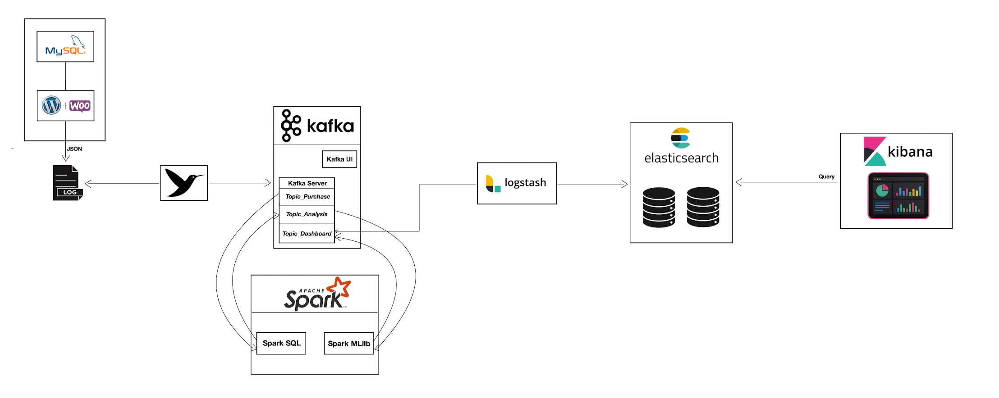

# Behavioral Analysis for E-Commerce

> **Progetto_TAP ** > Una pipeline basata su architettura **TAP** (Transazione, Analisi, Presentazione) per l'analisi comportamentale e finanziaria di un E-Commerce.



## Obiettivo del Progetto:
Trasformare i dati transazionali grezzi (ordini) in informazioni di lavoro.  
Il seguente progetto utilizza il **Machine Learning (K-Means Clustering)** per profilare gli utenti in tempo reale in base al loro comportamento di navigazione e acquisto:
- **Impulsive Buyer:** Acquisto rapido, tempo rapido di decisione.
- **Reasoned Buyer:** Sessione lunga, acquisto ponderato.

### Installazione:
1. **Clona la repository:**
   ```bash
   git clone [https://github.com/tuo-username/nome-repo.git](https://github.com/tuo-username/nome-repo.git)
   cd nome-repo

### Comandi:
   ```bash
   docker-compose up -d --build ( REAL-TIME )
         // oppure ( BATCH SYSTEM )
   docker-compose up db WordPress fluent-bit kafka kafka-ui topics sparksql sparkmllib
   docker-compose down db WordPress fluent-bit sparksql sparkmllib
   docker-compose up logstash elasticsearch kibana
